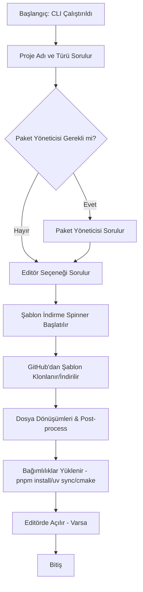

# Rust Rewrite Planı: `@kunver/new` CLI

Bu doküman, TypeScript ile yazılmış olan `@kunver/new` (bin adı: `kunver`) proje başlatıcı CLI aracının **Rust** diline taşınması (rewrite) için hazırlanan detaylı planı ve adımları içermektedir.

Ayrıca, şablonların (templates) artık CLI paketi içinde yerel olarak saklanması yerine, **harici GitHub depolarında** barındırılması ve CLI tarafından dinamik olarak çekilmesi stratejisi de bu plana dahil edilmiştir.

---

## 📊 Kütüphane ve Araç Karşılaştırması

TypeScript projesinde kullanılan bağımlılıkların Rust ekosistemindeki en uygun karşılıkları aşağıda listelenmiştir:

| TypeScript Bağımlılığı | Rust Karşılığı (Crate) | Açıklama / Avantajları |
| :--- | :--- | :--- |
| **`@inquirer/prompts`** | [`inquire`](https://crates.io/crates/inquire) | CLI üzerinden kullanıcıdan girdi alma, liste seçimi ve onay kutuları için tam uyumludur. Oldukça özelleştirilebilirdir. |
| **`chalk`** | [`colored`](https://crates.io/crates/colored) veya [`owo-colors`](https://crates.io/crates/owo-colors) | Terminal çıktılarını renklendirmek ve biçimlendirmek için kullanılır. |
| **`ora`** | [`indicatif`](https://crates.io/crates/indicatif) | İlerleme çubukları (progress bars) ve yükleme animasyonları (spinners) için Rust dünyasındaki endüstri standardıdır. |
| **`execa`** | [`std::process::Command`](https://doc.rust-lang.org/std/process/struct.Command.html) veya [`duct`](https://crates.io/crates/duct) | Alt süreçleri (child processes) çalıştırmak (örn: `pnpm install`, `uv sync`) ve çıktılarını yönetmek için kullanılır. `duct` borulama (piping) işlemlerini çok kolaylaştırır. |
| **`fs/promises`** | [`tokio::fs`](https://crates.io/crates/tokio) veya [`std::fs`](https://doc.rust-lang.org/std/fs/index.html) | Dosya okuma/yazma işlemleri. Eğer proje asenkron olacaksa `tokio` kullanılabilir, basit bir CLI için standart kütüphane (`std::fs`) de yeterlidir. |
| **Recursive Copy** | [`fs_extra`](https://crates.io/crates/fs_extra) | Şablon klasörlerini kopyalamak için pratik fonksiyonlar sunar (`fs_extra::dir::copy`). |
| **`JSON.parse` / `stringify`** | [`serde_json`](https://crates.io/crates/serde_json) | `package.json` dosyalarını okumak, güncellemek ve yazmak için kullanılır. |
| **Hata Yönetimi** | [`anyhow`](https://crates.io/crates/anyhow) | CLI uygulamalarında hata yönetimini sadeleştirmek ve hızlıca hata fırlatmak için kullanılır. |

---

## 🛠️ GitHub Şablonları (Templates) Yönetim Stratejisi

Mevcut yapıda tüm şablonlar CLI projesinin içinde (`src/public/templates/`) yer almaktadır. Rust rewrite ile birlikte şablonlar bağımsız GitHub depolarına taşınacaktır.

### 1. Şablon Depoları Yapısı
Her şablon için ayrı bir GitHub reposu oluşturulacaktır:
* `brkunver/template-react-ts-tw`
* `brkunver/template-next-prisma`
* `brkunver/template-cmake-cpp`
* `brkunver/template-uv-notebook`
* `brkunver/template-wxt-solid`
* `brkunver/template-wxt-svelte`
* `brkunver/template-wxt-vanilla`

> [!NOTE]
> Şablonların ayrı depolarda olması, şablon güncellemeleri için CLI aracının yeni bir versiyonunun yayınlanması zorunluluğunu ortadan kaldırır. Şablonlar kendi içlerinde bağımsız olarak test edilebilir ve güncellenebilir.

### 2. Şablon Çekme (Download/Clone) Mekanizması
CLI, seçilen şablonu indirmek için iki farklı yöntem kullanabilir:

* **Yöntem A (Git CLI - Tavsiye Edilen):**
  Sistemde kurulu olan `git` aracını kullanarak sığ bir klonlama (shallow clone) yapar:
  ```bash
  git clone --depth 1 https://github.com/brkunver/template-react-ts-tw.git <hedef_klasor>
  ```
  Ardından oluşturulan klasörün içindeki `.git` klasörünü siler.
  * *Avantajı:* Çok basit, ek kütüphane bağımlılığı gerektirmez ve SSH/HTTPS yetkilendirmelerini otomatik kullanır.
  * *Dezavantajı:* Kullanıcının sisteminde `git` kurulu olmalıdır (geliştiriciler için bu genelde sorun değildir).

* **Yöntem B (HTTP & Zip - Alternatif):**
  [`reqwest`](https://crates.io/crates/reqwest) ve [`zip`](https://crates.io/crates/zip) crate'leri kullanılarak ilgili GitHub reposunun main zip arşivi indirilir ve hedefe açılır:
  `https://github.com/brkunver/template-react-ts-tw/archive/refs/heads/main.zip`
  * *Avantajı:* Sistemde `git` kurulu olma zorunluluğunu ortadan kaldırır.
  * *Dezavantajı:* Derleme süresini ve binary boyutunu artıran ek crate'ler gerektirir.

> [!TIP]
> **Önbellekleme (Caching):** İndirilen şablonların internet bağlantısı olmadığında da kullanılabilmesi veya ikinci kez daha hızlı kurulabilmesi için kullanıcının ana dizininde (örn: `~/.kunver/templates/`) bir önbellek mekanizması kurulabilir.

---

## 🗺️ Adım Adım Rewrite Yol Haritası



### Adım 1: Rust Projesinin Kurulması
1. Yeni bir binary cargo projesi oluşturun:
   ```bash
   cargo new kunver --bin
   ```
2. `Cargo.toml` dosyasına gerekli bağımlılıkları ekleyin:
   ```toml
   [dependencies]
   inquire = "0.7"
   colored = "2.1"
   indicatif = "0.17"
   serde = { version = "1.0", features = ["derive"] }
   serde_json = "1.0"
   fs_extra = "1.3"
   anyhow = "1.0"
   # Opsiyonel: duct = "0.13" (Süreç yönetimi için)
   ```

### Adım 2: CLI İnteraktif Akışının (Prompts) Yazılması
1. TypeScript projesindeki `src/index.ts` mantığını Rust'a taşıyın.
2. `inquire::Text` kullanarak proje adını isteyin ve TS'teki Regex/klasör varlığı doğrulamasını (validation) Rust tarafında gerçekleştirin.
3. `inquire::Select` kullanarak proje türünü (`react-ts-tw`, `next-prisma`, `wxt`, vb.) ve paket yöneticisini (`pnpm`, `npm`, `bun`) seçtirin.
4. Editörde açma seçeneğini (`antigravity`, `windsurf`, `cursor`, `code`, `no`) soran seçimi ekleyin.

### Adım 3: Şablon İndirici (Template Downloader) İmplementasyonu
1. Seçilen proje türüne göre hedef GitHub URL'sini belirleyen bir eşleme (mapping) yapısı oluşturun.
2. `indicatif` spinner'ını başlatın.
3. `std::process::Command` ile `git clone --depth 1 <URL> <hedef>` komutunu çalıştırarak şablonu indirin.
4. Başarıyla indirildikten sonra hedef klasördeki `.git` dizinini (`std::fs::remove_dir_all`) temizleyin.

### Adım 4: Dosya Dönüşümleri (Helper Fonksiyonlar)
1. **Dot-Prefixed Dosyalar:** Şablon reposunda bulunan `_gitignore` veya `_clang-format` gibi alt çizgi ile başlayan dosyaları arayıp noktaya çeviren mantığı (`_gitignore` -> `.gitignore`) yazın. TypeScript'teki `restoreDotPrefixedNames` fonksiyonunu Rust'ta recursive directory traversal yaparak uygulayın:
   ```rust
   // Örnek pseudocode mantığı
   fn restore_dot_files(dir: &Path) -> Result<()> {
       for entry in fs::read_dir(dir)? {
           let entry = entry?;
           let path = entry.path();
           if path.is_dir() {
               restore_dot_files(&path)?;
           }
           if let Some(name) = path.file_name().and_then(|n| n.to_str()) {
               if name.starts_with('_') && name.len() > 1 {
                   let new_name = format!(".{}", &name[1..]);
                   fs::rename(&path, path.with_file_name(new_name))?;
               }
           }
       }
       Ok(())
   }
   ```
2. **`package.json` Güncelleme:** `serde_json` kullanarak `package.json` dosyasını okuyun, `name` değerini kullanıcının girdiğine göre güncelleyin ve tekrar dosyaya yazın (`src/helpers/postinstall.ts` karşılığı).

### Adım 5: Özel Proje Başlatıcı Adımları (Starters)
Mevcut projedeki özel başlatıcı mantıklarını Rust'a taşıyın:
* **WXT Starter (`create-wxt.ts`):**
  * Kullanıcıdan WXT framework'ünü (`svelte`, `solid`, `vanilla`) seçmesini isteyin.
  * Özelleştirme seçeneklerini sorun (i18n, content UI, wxt-storage).
  * İlgili şablonu indirdikten sonra, seçilen özelliklere göre dosyalarda değişiklik yapın (örn: `wxt.config.ts` dosyasına regex ile izin ekleme, `package.json` dosyasına `@wxt-dev/i18n` ekleme, gereksiz dosyaları silme).
* **Python Notebook Starter (`create-python-notebook.ts`):**
  * `uv-notebook` şablonunu indirdikten sonra `std::process::Command` ile `uv sync` komutunu çalıştırın.
* **CMake C++ Starter (`cmake-cpp`):**
  * `CMakeLists.txt` içerisindeki `project(...)` adını kullanıcının proje adıyla değiştirin.
  * Otomatik olarak `cmake -S . -B build` komutunu tetikleyin.

### Adım 6: Editör Entegrasyonu & Paket Yöneticisi Kurulumları
1. TypeScript'teki `approveBuilds` mantığını (örn: `pnpm approve-builds` or `bun pm trust --all`) Rust'a aktarın.
2. `installDependencies` mantığını port ederek seçilen paket yöneticisi ile `install` işlemini alt süreç (child process) olarak çalıştırın.
3. TS'teki `openInEditor` fonksiyonunu port ederek, seçilen editör komutunu (`code`, `cursor` vb.) proje klasöründe çalıştırın.

---

## 🚀 Yayınlama ve Dağıtım Stratejisi

Rust ile yazılan CLI aracının kullanıcılara ulaştırılması için iki ana yol izlenebilir:

1. **NPM Wrapper (Önerilen - Geriye Dönük Uyumluluk İçin):**
   Mevcut `@kunver/new` paketinin içine Rust ile derlenen platforma özel binary'leri (Windows, macOS, Linux) paketleyen ve kullanıcının işletim sistemine uygun olanı çalıştıran ince bir JS wrapper yazılabilir. (Bkz: `esbuild` veya `tailwind` CLI'ın npm üzerinden dağıtılması yöntemi).
2. **Doğrudan Cargo Üzerinden:**
   Kullanıcıların `cargo install kunver` komutuyla aracı doğrudan kendi bilgisayarlarında derleyip kurması sağlanabilir.
3. **GitHub Releases:**
   GitHub Actions aracılığıyla her yeni sürümde otomatik olarak cross-compile yapılarak binary'lerin sürümlere eklenmesi sağlanabilir.

---

> [!IMPORTANT]
> Rust rewrite projesi bittiğinde CLI boyutu oldukça küçük olacak, şablonlar dinamik olarak çekildiği için güncel kalacak ve Node.js bağımlılığı olmadan yerel olarak çok hızlı bir şekilde çalışacaktır.
